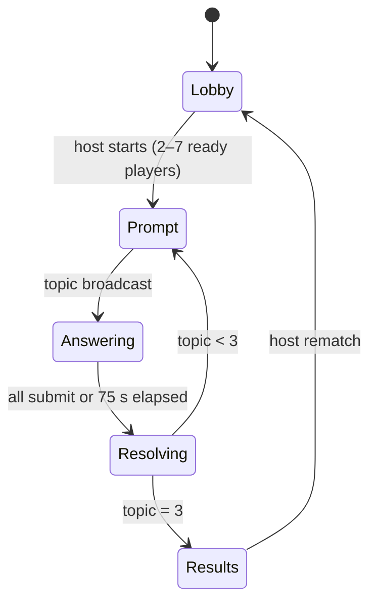
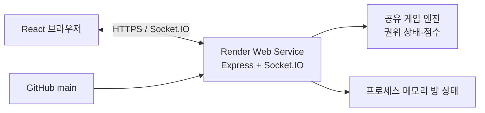

# JinxO Online 실행 계획

## 접근 방식

JinxO는 같은 주제에 대한 3개 답안을 비공개로 작성한 뒤 일치도를 자동 판정해 개인 3×3 보드에 쌓는 실시간 파티 게임으로 만든다. 원작 규칙대로 3개 주제에서 각 3개 답안을 기록해 총 9칸을 채운다. 첫 버전은 가입 없는 초대방(2~7명), 결과 및 재대결에 집중한다. TypeScript 모노레포로 구성해 브라우저 UI와 Socket.IO 게임 서버가 하나의 순수 게임 엔진·이벤트 계약을 공유하도록 한다. Render에는 Web Service 하나를 배포해 정적 클라이언트와 WebSocket 서버를 함께 제공한다.

## 디자인 기준

Stitch 프로젝트 `1161748266449457266`에서 확인한 대기실, 플레이 화면, 결과 화면을 정보 구조의 기준으로 사용한다. 모바일(390px) 우선으로 구현하고 넓은 화면은 좌측 게임 보드와 우측 상태/플레이어 패널의 2열 구조로 확장한다.

| 요소 | 구현 기준 |
| --- | --- |
| 브랜드 | Pop-art brutalism + Neo-Memphis. 물리 보드게임 같은 반응성과 레이어감을 유지한다. |
| 색 | Hot pink `#FF00FF`(주요 행동/승리), cyan `#00FFFF`(상호작용/플레이어), lime `#CCFF00`(일치/진행), vibrant yellow(주제 카드·강조), deep ink `#1A1A1A`(텍스트·윤곽). |
| 글꼴 | 제목은 Bricolage Grotesque, 본문은 Plus Jakarta Sans, 타이머·라벨·칸 번호는 Space Grotesk. 한글 대체 글꼴도 지정한다. |
| 형태 | 카드/칸 16px radius, 2~4px deep-ink 테두리, 4~8px 무블러 하드 섀도. 누른 버튼은 그림자가 사라지며 4px 이동한다. |
| 게임 보드 | 12px 간격의 3×3 정사각형. 기본은 흰 칸, 일치 시 라임 + 별 배지, 미일치/빈 칸은 X. |
| 접근성 | 네온색만으로 상태를 구분하지 않고 ○/★/× 텍스트·아이콘, 포커스 링, `prefers-reduced-motion`, 색 대비를 제공한다. |

## 게임 시스템

### 상태와 권한

`room`은 초대 코드, 호스트 연결 ID, 최대 인원 7명, 현재 게임 상태를 가진다. 접속자는 닉네임을 정한 뒤 방에 들어오며, 호스트만 게임 시작·재대결 시작을 요청할 수 있다. 서버가 라운드 전환, 시간 만료, 판정, 점수 계산의 유일한 권위자가 된다. 클라이언트는 서버가 발급한 일시 세션 토큰으로 재연결한다.

### 라운드와 판정

1. 서버가 중복 없이 내장 주제 덱에서 한 장을 뽑아 모든 플레이어에게 공개한다.
2. 각 플레이어는 75초 안에 서로 다른 답 3개를 입력하고 한 번에 제출한다. 만료 시 완성한 답만 제출한다.
3. 서버는 Unicode 정규화(NFKC), 앞뒤/연속 공백 제거, 소문자화, 기본 문장부호 제거로 답안을 비교한다. 빈 값은 비교 대상이 아니다.
4. 같은 정규화 답안을 낸 사람이 2명이면 그 답을 쓴 모든 보드 칸에 `circle + star`, 3명 이상이면 `circle`, 1명이면 `cross`를 기록한다. 같은 플레이어의 중복 답은 제출 단계에서 막는다.
5. 판정 화면은 그룹별 일치 답과 각자의 3개 보드 업데이트를 동시에 보여 준다. 이후 다음 라운드로 진행한다.

### 최종 점수

3개 주제에서 각각 답 3개를 기록해 9칸을 모두 채운 뒤 ○=1점, ★=2점, ×=0점으로 합산한다. ○만으로 완성된 가로/세로/대각선 줄을 계산해 보너스를 더한다. 동점은 **빙고 줄 수 → 별 수 → 공동 우승** 순서다.

## 구현 단계

1. **프로젝트 뼈대와 공통 계약** — 루트에 `apps/web`, `apps/server`, `packages/game-engine`, `packages/shared`, 워크스페이스 설정, TypeScript strict, ESLint/Prettier, Vitest를 구성한다. `shared`에 Socket 이벤트 스키마(Zod)·상태 타입을, `game-engine`에 상태 전이와 점수 계산을 둔다.
   - 검증: `pnpm lint`, `pnpm typecheck`, `pnpm test`가 빈 뼈대에서도 통과한다.

2. **순수 규칙 엔진** — 주제 덱, 3개 답 검증, 답안 정규화·그룹화, 3개 주제 상태 전이, 각 주제의 3답안을 3×3 보드의 다음 3칸에 기록하는 로직, 빙고/동점 계산을 `packages/game-engine`에 구현한다. 시간은 서버 주입 시계로 계산해 테스트 가능하게 한다.
   - 검증: Vitest로 공백/대소문자/문장부호 일치, 빈 칸, 중복 답 거절, 2명/3명 이상 판정, 3주제×3칸 기록, 행·열·대각선, 공동 우승을 망라한다.

3. **실시간 방 서버** — Express + Socket.IO 서버에서 방 생성/입장/퇴장/재연결, 호스트 권한, 최대 7명, 라운드 타이머, 제출 잠금, 이벤트 방송을 만든다. 메모리 저장으로 시작하고 인스턴스 1개 고정 배포를 명시한다.
   - 검증: Socket.IO 통합 테스트로 두 클라이언트의 방 합류·게임 시작·자동 타임아웃·동시 제출·재연결을 검증하고, 잘못된 이벤트/비호스트 시작을 거절한다.

4. **Stitch 기반 프론트엔드** — React/Vite에 홈(닉네임·방 생성/입장), 대기실, 답안 입력, 판정 전환, 3×3 게임 보드, 결과/재대결 화면을 구현한다. Stitch의 `Jinxo - Waiting Room`, `Jinxo - Play Now`, `Jinxo - Game Results`를 레이아웃 레퍼런스로 삼아 디자인 토큰과 컴포넌트를 분리한다.
   - 검증: Storybook 또는 컴포넌트 테스트로 상태 배지와 보드를 확인하고, Playwright로 390px 및 1440px에서 방 입장→제출→결과 흐름의 시각 회귀 스크린샷을 만든다.

5. **콘텐츠·품질·안전성** — 한국어 일반 주제 카드 100개 이상을 데이터 파일로 제공하고 중복/부적절 표현을 검토한다. 새로고침/잠깐의 연결 단절 UI, 타이머 동기화, 방 종료 안내, 키보드 입력·스크린리더 라벨을 정리한다.
   - 검증: 콘텐츠 스키마 테스트, Lighthouse 접근성 점검, 2·3·7명 수동 멀티탭 플레이테스트를 수행한다.

6. **Render 배포 구성** — Dockerfile 또는 Render Blueprint `render.yaml`을 추가해 Node 버전, build/start 명령, WebSocket 허용, 헬스체크(`/health`), 환경 변수(`PORT`, `SESSION_SECRET`, `CLIENT_ORIGIN`)를 명시한다. Render 프로젝트 `prj-d9s72jqfngtc73en1ch0`에서 GitHub 저장소를 Web Service로 연결하고 브랜치 자동 배포 및 공개 URL을 확인한다.
   - 검증: Render 배포 로그의 build/start 성공, `/health` 200, 배포 URL에서 두 브라우저 세션으로 Socket 연결과 한 라운드 완주를 확인한다.

7. **인계** — `README.md`에 로컬 실행, 테스트, 환경 변수, 배포 절차, 룰 요약을 기록한다. 변경을 GitHub `KyusungJung/JinxO_Online`의 `main`에 의도적인 커밋으로 푸시한다.
   - 검증: `git status`가 깨끗하고, 원격 `main`의 커밋 SHA와 로컬 HEAD가 일치하며, CI가 있다면 통과한다.

## 배포 아키텍처와 제약

초기 배포는 단일 Render 인스턴스와 프로세스 메모리 방 상태를 전제로 한다. 수평 확장, 무중단 재시작 뒤 방 복구, 영구 계정·랭킹은 Redis/DB와 Socket adapter가 필요한 후속 범위다.

## 확인이 필요한 게임 결정

1. **빙고 한 줄의 보너스 점수**: 첨부 규칙에는 “보너스 점수”만 있고 수치가 없습니다. 첫 버전은 몇 점으로 할까요? 추천은 ○ 3점과 비슷한 체감이 나는 **줄당 3점**입니다.
2. **연결이 끊긴 플레이어**: 75초 라운드 중 이탈하면 그 라운드만 빈 답(X)으로 처리하고 재연결을 허용하는 안을 추천합니다. 전체 게임을 잠시 멈추는 규칙이 더 적합한가요?
3. **금칙어/주제 검수**: 첫 버전의 내장 주제 100개는 일반적인 일상·취향 카테고리만으로 제한할까요, 아니면 성인/수위 있는 파티 주제도 포함할까요? 추천은 전자입니다.

## 위험 요소

- 문자 정규화는 유사어를 같은 답으로 보지 않는다. 자동 정확 일치의 공정성을 설명 UI에 명확히 표기한다.
- Render 무료/저사양 인스턴스의 휴면 및 단일 인스턴스 제약은 방의 실시간성에 영향을 줄 수 있다. 출시 전 실제 서비스 플랜과 동시 접속 목표를 확인한다.
- GitHub 원격은 현재 빈 저장소이며, Render 연동용 전용 MCP 도구는 이 세션에 노출되지 않았다. 배포 설정은 Render 대시보드 또는 브라우저를 통해 실제 권한 상태에서 마무리한다.
